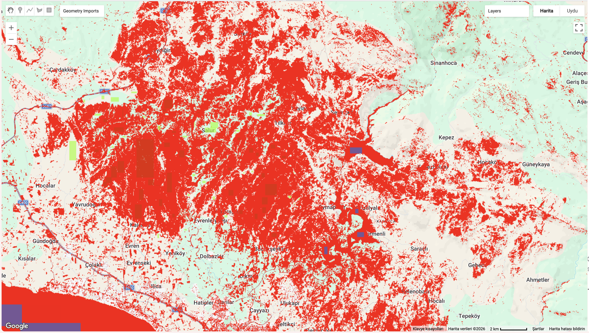
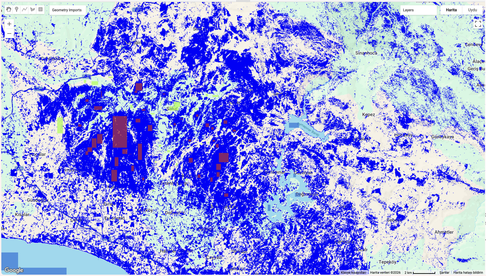

# Wildfire Detection using Remote Sensing & Machine Learning

## Problem Statement

Wildfires cause significant environmental and economic damage worldwide.  
Accurate and fast detection of burned areas is critical for disaster response and ecological assessment.

Traditional methods are time-consuming and not scalable.  
This project aims to automate burned area detection using satellite imagery and machine learning.

## Project Description
This project focuses on detecting wildfire-affected areas using Sentinel-2 satellite imagery and machine learning models in Google Earth Engine.

The system analyzes post-fire satellite data to classify burned areas and evaluate model performance.

---

## Case Study: Manavgat Wildfire (2021)

This project demonstrates the methodology using the Manavgat wildfire event in Turkey.  
However, the pipeline is designed to be adaptable to different geographic regions and wildfire events.

---

## Technologies Used
- Google Earth Engine (GEE)
- JavaScript
- Sentinel-2 Satellite Data
- Machine Learning:
  - Random Forest
  - Support Vector Machine (SVM)

---

## How It Works

1. Satellite imagery is filtered (low cloud coverage)
2. Training data is labeled:
   - Burned areas
   - Healthy vegetation
   - Water (for improved classification)
3. Models are trained and evaluated
4. Burned areas are classified and visualized
5. Total burned area is calculated (hectares)

---

## Model Comparison (Random Forest vs SVM)

### Results:

- Random Forest Accuracy: **0.9757**  
- SVM Accuracy: **0.9079**  

- RF Burned Area: **35,794 ha**  
- SVM Burned Area: **53,060 ha**  
- Difference: **17,265 ha**

### Key Insight:
Random Forest produces more reliable and stable results, while SVM tends to overestimate burned areas.

---

## Error Analysis (Impact of Water Class)

### Results:

- SVM V1 Accuracy: **0.9925**  
- SVM V2 Accuracy: **0.9967**

### Confusion Matrix:

**V1 (Without Water Class):**
[[1063,19],
[20,4140]]

**V2 (With Water Class):**
[[992,47,0],
[65,4182,0],
[0,0,29650]]

### Key Insight:
Including water as a separate class significantly reduces misclassification and improves model robustness.

---

## Visual Results

### dNBR & Burn Severity

### Burned Area Detection

### Post-Fire Satellite Image

---

### Model Comparison

---

### Error Analysis

---

## Project Structure
images/
dnbr-severity-map.png
burned-area-detection.png
post-fire-image.png
model-rf.png
model-svm.png
model-comparison.png
svm-v1.png
svm-v2.png
error-difference.png

src/
dNBR-analysis.js
data-preprocessing.js
random-forest-classification.js
model-comparison.js
error-analysis.js

---

## How to Run

1. Open Google Earth Engine Code Editor  
2. Copy the scripts from the `src/` folder  
3. Run the code  
4. Visualize results on the map

---

## Future Improvements

- Integrate Deep Learning models (CNN)
- Automate wildfire detection pipeline
- Add real-time monitoring capability
- Build a web-based visualization dashboard

---

## Project Highlights

- Remote sensing + machine learning integration  
- Model comparison (RF vs SVM)  
- Error analysis with class improvement  
- Real-world wildfire case study  
- Scalable to different geographic regions  

---

## Contact

If you’d like to collaborate or discuss this project, feel free to reach out!
